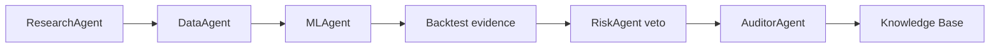

# Phase 3: Autonomous Agent Orchestration

Phase 3 provides a governed research operating system, not autonomous trading. The `OrchestratorAgent` runs declarative workflows. The task queue enforces dependencies; the registry tracks specialist availability; the message bus records typed requests, responses, reviews, approvals, and alerts.

Reviews prohibit self-approval. A rejection by `RiskAgent` or `AuditorAgent` vetoes an artifact. `AgentMemoryStore` is a DuckDB local fallback; `VectorMemory` and `VectorStore` are interfaces for PostgreSQL/pgvector production storage.

Example workflow: ResearchAgent proposes a momentum hypothesis, DataAgent validates features, MLAgent trains chronologically, then evidence is independently reviewed by Risk and Audit before a report is stored as knowledge.

`AutonomousResearchLoop` executes one scheduled workflow pass and writes a resulting institutional-memory document. `ResearchScheduler` supplies the safe host-controlled schedule. `AgentPerformanceTracker` records task outcomes and exposes completion, success, rejection, and quality metrics.
